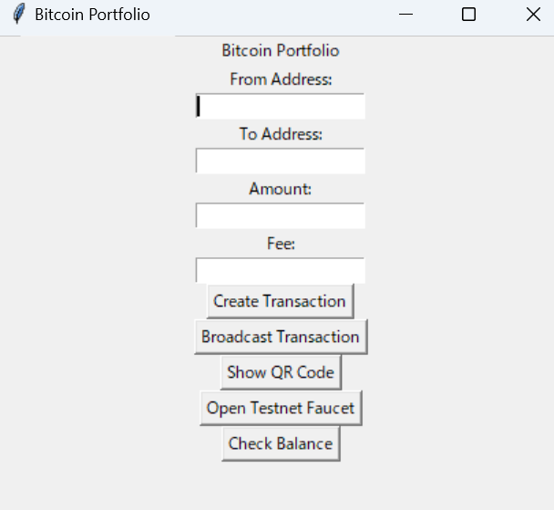

# Bitcoin Portfolio
This is a Python-based Bitcoin wallet application designed to work on the Bitcoin Testnet.
It implements everything from key generation with elliptic curve cryptography, P2PKH transaction creation, signing, broadcasting, QR code generation, CLI and GUI interfaces, and faucet integration — all built from scratch for learning and experimentation.

##  Features
-  Wallet generation (private/public keys, WIF, address creation)
-  Transaction creation, signing, and broadcasting
-  Works exclusively on Bitcoin Testnet (not mainnet)
-  CLI tools for wallet management and sending coins
-  GUI interface built with Tkinter for user-friendly operation
-  QR code generation for addresses and transactions
-  Faucet integration for easy testnet coin acquisition
-  Minimal external libraries, emphasizing low-level implementation for education

##  Directory Structure
```
src/
├── block.py         # Bitcoin block parsing and structure
├── cli.py           # Command-line interface scripts
├── ecc.py           # Elliptic curve cryptography (keygen, signing)
├── faucet.py        # Faucet integration for testnet coins
├── gui.py           # Tkinter-based GUI frontend
├── helper.py        # Utility functions (encoding, hashing, etc.)
├── main.py          # Application entry point (CLI launcher)
├── network.py       # P2P node communication
├── op.py            # Bitcoin Script OP code definitions
├── script.py        # Script parsing and evaluation engine
├── tx.py            # Transaction structure, signing, verification
├── tx_manager.py    # Transaction creation and wallet management
├── utxo.py          # UTXO fetching from Blockstream API
├── wallet.py        # Wallet management (key generation, saving/loading)
└── __init__.py
```

##  Setup
1. Python Version
Recommended Python 3.8+

2. (Recommended) Create virtual environment
```bash
    python -m venv .venv
    source .venv/bin/activate  # macOS/Linux
    .\.venv\Scripts\activate   # Windows
```

3. Install dependencies
```bash
- pip install -r requirements.txt
```

##  Usage
CLI
```bash
python -m src.main
```
- Wallet auto-generates if none exists
- Retrieve testnet addresses
- Create, sign, and broadcast transactions on testnet

GUI
```bash
python -m src.gui
```
- User-friendly GUI for wallet operations
- QR code display for addresses and transactions
- Faucet assistance for easy testnet coin funding

## GUI Preview
Below is a screenshot of the Tkinter-based GUI interface:
<p>
  
</p>

##  Broadcasting Options
- Broadcast via P2P socket communication directly to nodes
- Broadcast via HTTP API using Blockstream’s service

##  Important Notes
- This project works only on Bitcoin Testnet.
- Not intended for mainnet or real BTC use.
- Not optimized for security or production usage.
- Intended for educational, experimental, and development purposes only.

## Credits & References
- Inspired by Jimmy Song’s Programming Bitcoin
- Uses Blockstream API (https://blockstream.info)
